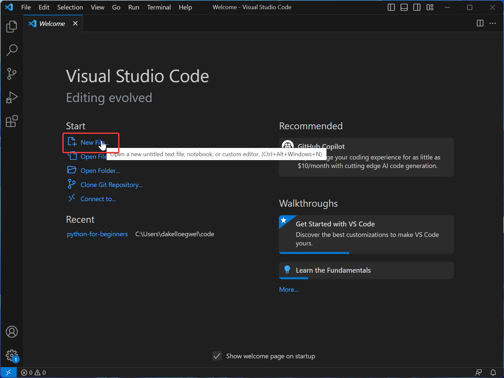
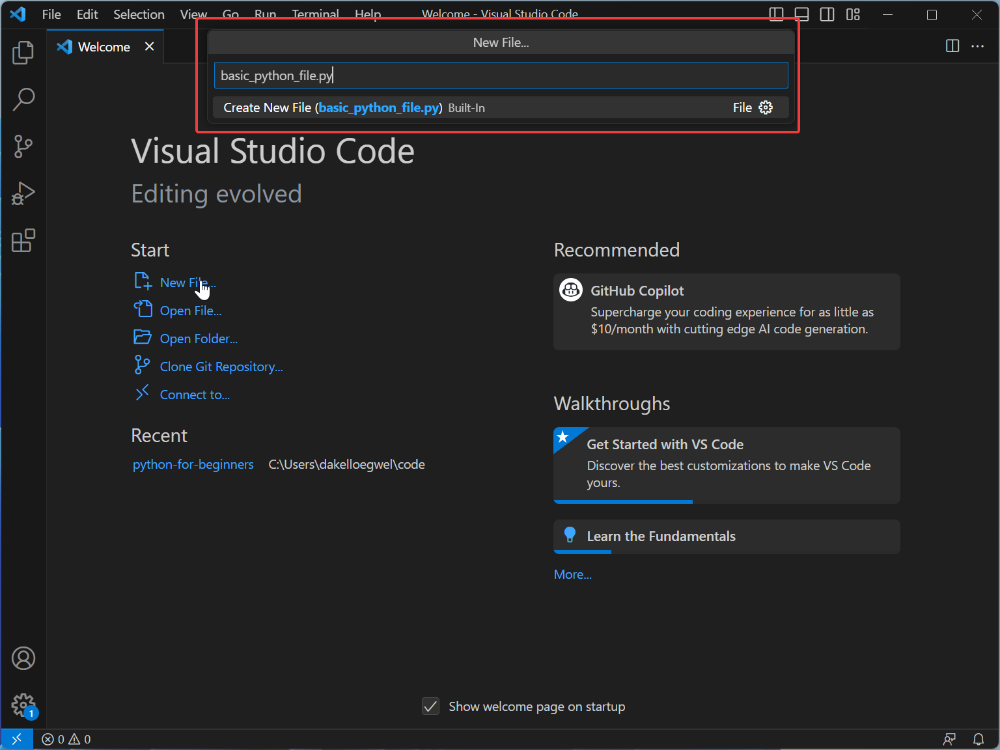
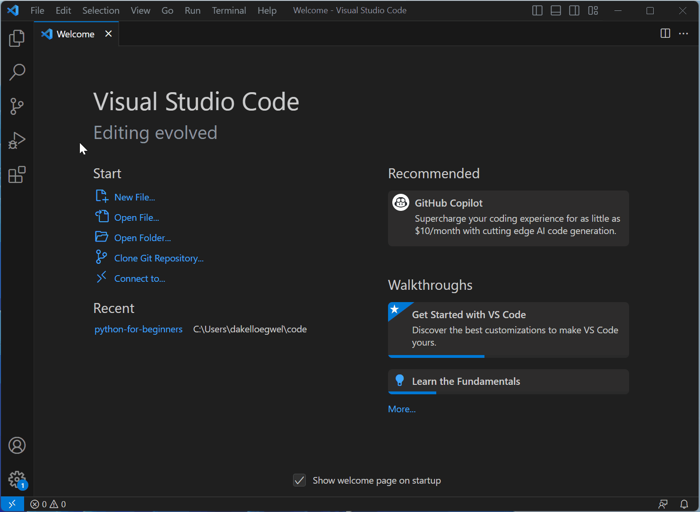
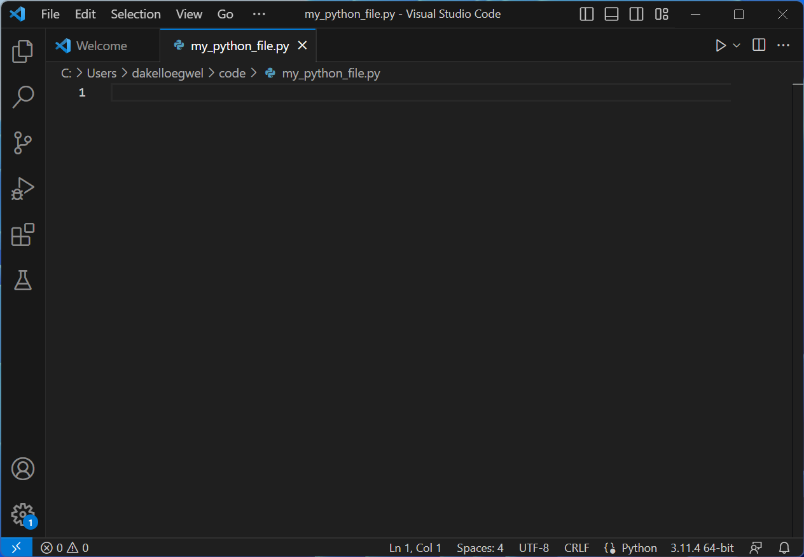

# Getting Started

## Creating a Python File

We can make a simple Python program to do some maths for us. Start by creating a new file in VSCode.

Now give the Python file a name. It must end in `.py`.

After that, choose a folder for saving the file. 

Now we can see our new Python file open in VSCode.

## Using Python as a Calculator

