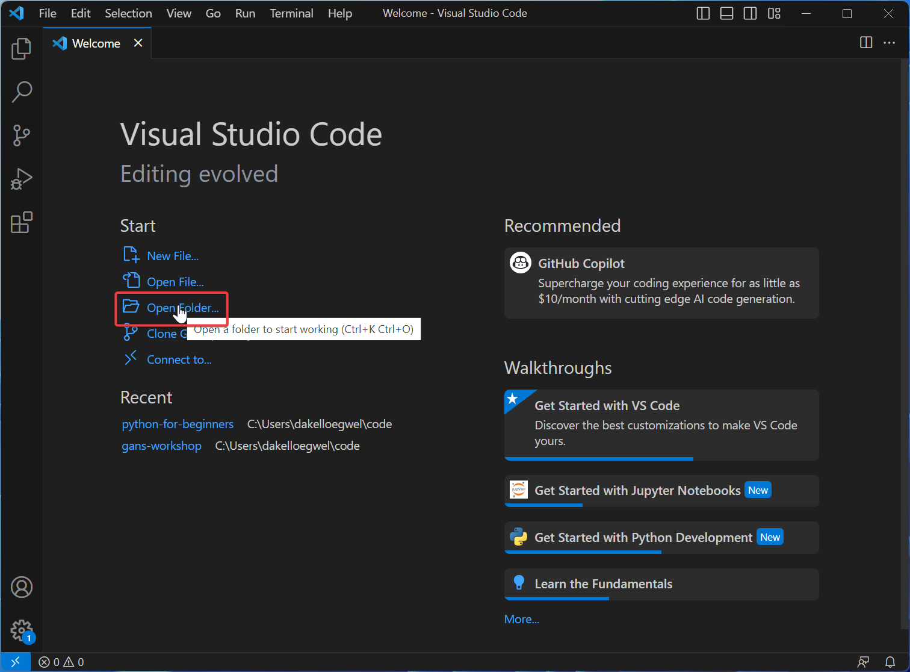
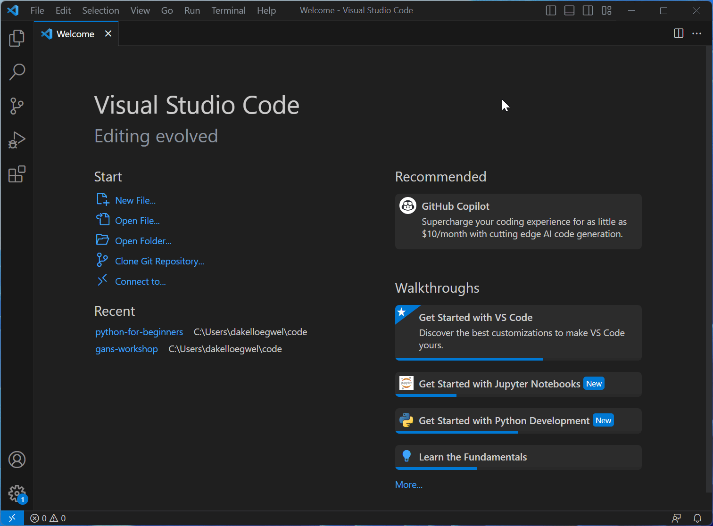
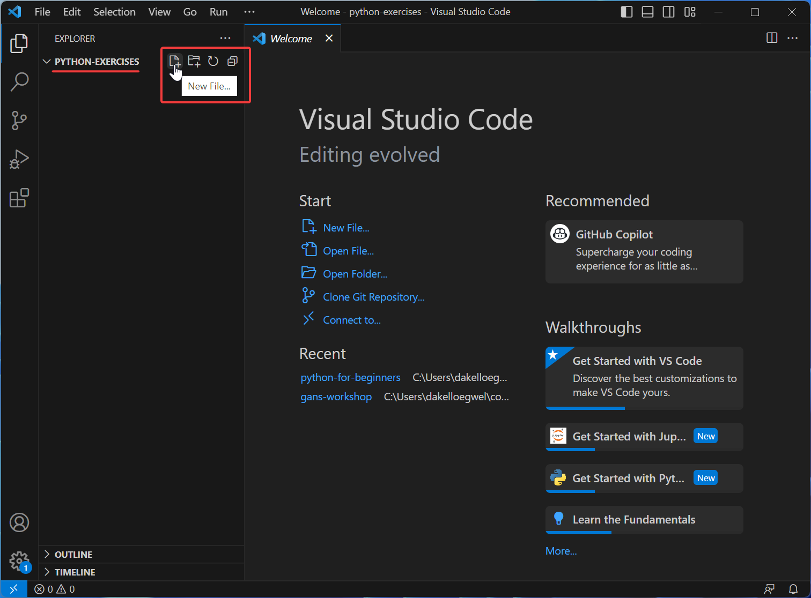
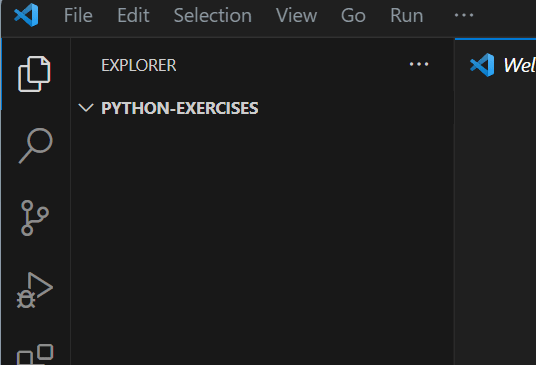
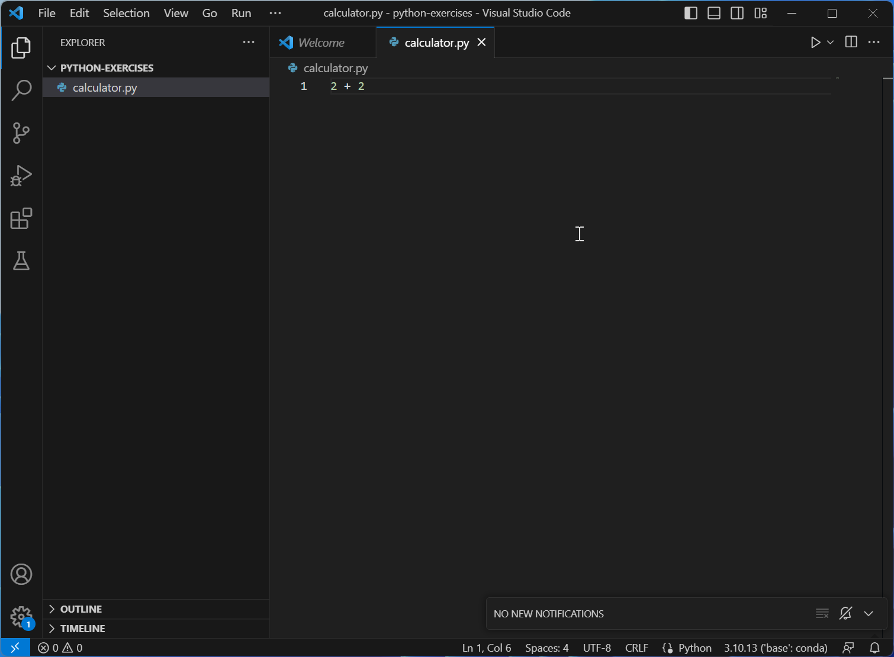
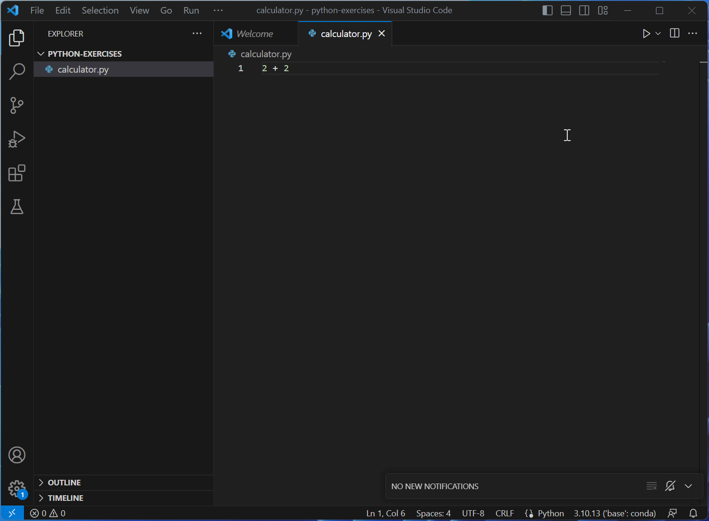
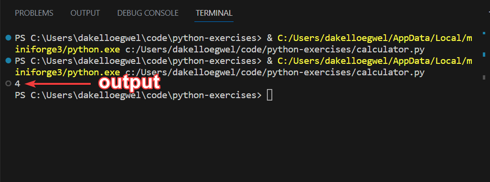
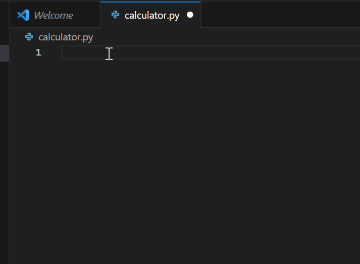
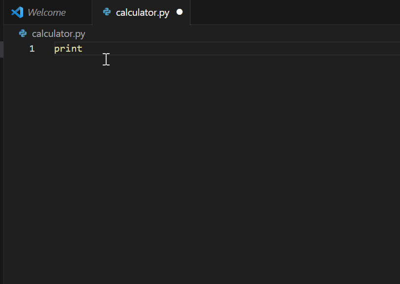

# Getting Started

## Creating a Python File

We can make a simple Python program to do some maths for us. Start by opening a folder in VS Code.



Now, using either Explorer (Windows) or Finder (Mac), create a folder named "python-exercises." Make sure the folder is in a location that is easy to remember. Now open the folder and click "Select Folder".



Now we can see that this folder has been opened with VS Code. Click on the "New File" icon to create a new file within the folder.



Name this file "calculator.py". By giving it the `.py` extention, VS Code knows to treat it as a Python file. This will cause the new file to then open in the editor area.



## `print()` and Using Python as a Calculator

Now enter the code `2 + 2` in your `calculator.py` file and save it. Ctrl / Command + S is a useful shortcut for saving. Your window should now look like this:



Now we can run our code. We can do this by pressing the Run / Play button in the upper-right corner of the editor region. This will lead to a terminal pane being opened.



The information in the terminal is telling us is that the base Conda / Mamba Python was used to run our file. However, we don't see anything else because this particular file did not generate any output. If we want to see the _result_ of `2 + 2`, we need to use Python's `print()` command.

Now, instead have the code run `print(2 + 2)` and then save your file and run it again.



In Python, `print()` is a built-in command used to display output to the console. It takes zero or more values and displays them as text.

> **EXTRA**: Try using the division `\` , multiplication `*`, and power `**` operators to perform other calculations.

### Auto Complete and Parameter Hints

As you were typing out the `print()` command earlier, you may have noticed a box appear with a list of items. At first it's a list of items beginning with p, and then a list of items with the letters p and r in them, and so-on. This is a feature found in many IDEs known as Auto Complete. The purpose of Auto Complete is to save you some extra keystrokes by presenting you with a list of things it thinks you are in the process of typing out. If the item at the top of the list is what you're after then you can hit the Enter key and the rest will be entered in for you.

In the example below, just the letters "pri" are typed out. By pressing Enter, Auto Complete then takes care of the rest and finished writing out the command for me.



Another helpful features in IDEs is Parameter Hints. This gives us a description of a command we are working with and some guidance on how it should be used.



As you code more in Python, you'll find yourself using more commands that need to be used in a specific way and that expect its inputs to be given in a specific order. Getting a reminder from the IDE on how this should be done can save a bit of Googling time.

## Comments

When you run Python code, something called the **Python Interpreter** converts Python code into something the machine can understand. When the interpreter encouters the # symbol it ignores this symbol and any text following it. Comments allow you to clarify your code, which can be especially helpful for your future self or other people you are working with. Getting into the habit of writing comments helps make your code more maintainable in the long-run.

```python
# this bit of text will not be run
print(1 + 1) # this print statement will be run
```

## Summary

- VS Code can be used to manage Python projects containing multiple files.
- Python can perform basic maths.
- The `print()` command in Python can display information on our terminal.
- Auto Complete helps shorten the process of typing out something while coding.
- Parameter Hints remind us how a command should be used, and what inputs it's expecting.

---
[Prev](introduction.md) | [List of Contents](README.md) | [Next](variables.md)