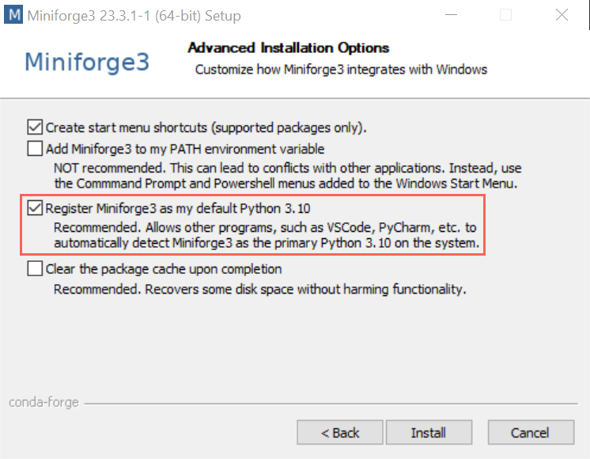
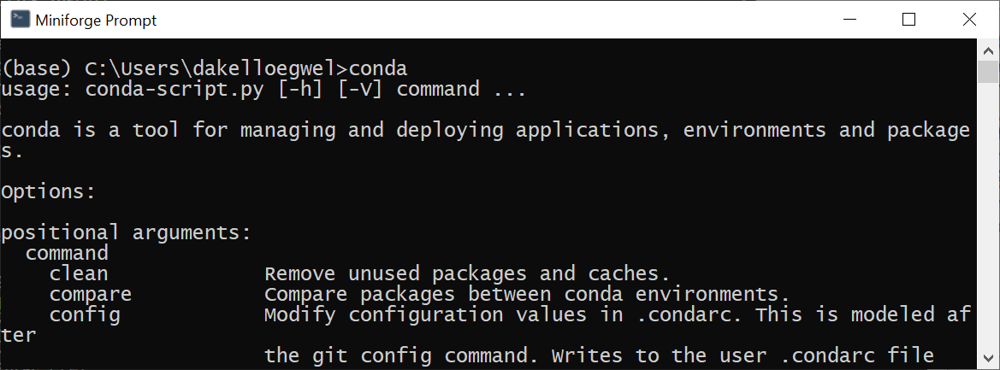
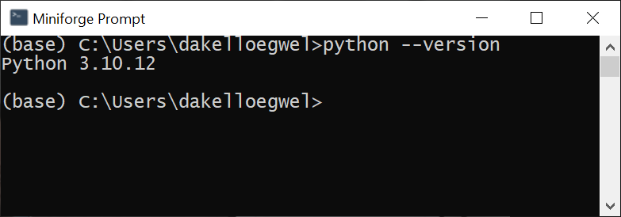
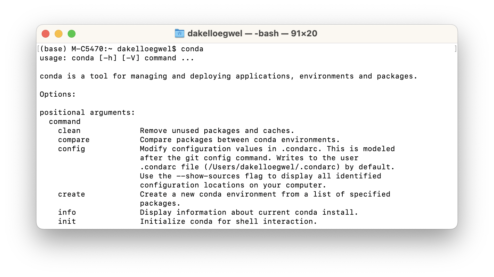
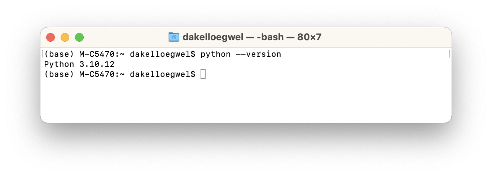
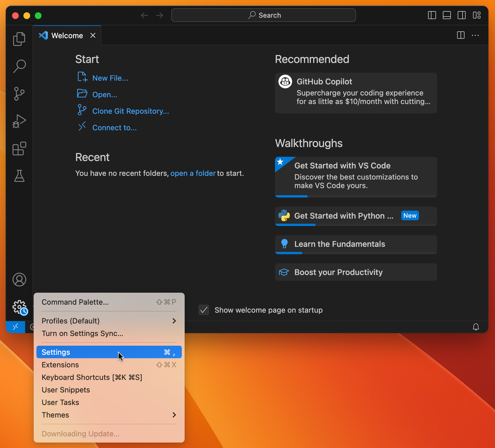
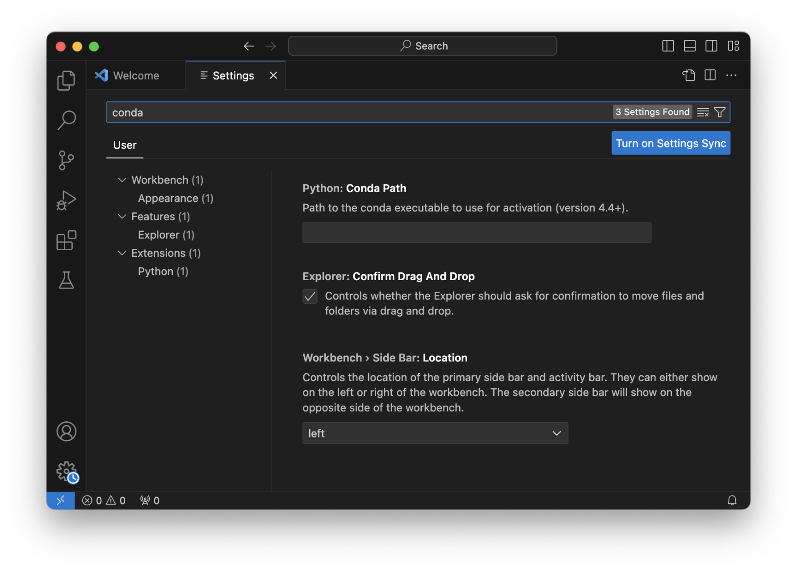
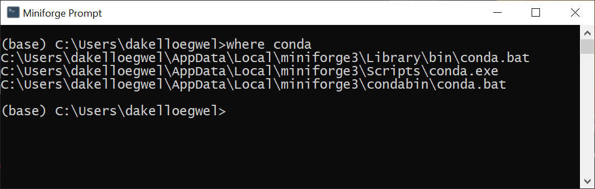
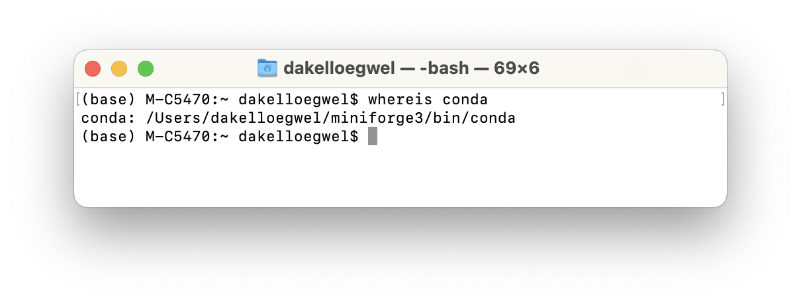

# Introduction

## Why Python?

Python is a highly versatile programming language, making it suitable for diverse domains such as web development, data analysis, and machine learning. One very important strength of Python is its extensive library support, which allow you to add a broad spectrum of additional functionalities for your code.

Moreover, Python can be used to interface with other software tools like Touch Designer, Unreal Engine, and Unity.

## Installing Miniforge

Miniforge, a distribution of Conda, serves as a comprehensive package manager and environment management system, simplifying package installation and dependency management. Its utility lies in the ability to manage separate Python environments for different projects. This in turn prevents issues from arising if different projects require different versions of Python or different versions of the same library. Another advantage of using environments is that they can easily be deleted once a project has been completed, which allows us to keep our core Python installation "clean" from add-ons that are no longer needed. Follow the steps below to install Miniforge on your system.

### Windows

1. Navigate to the [Miniforge GitHub page](https://github.com/conda-forge/miniforge#miniforge3).
2. Download the Windows installer and run the setup file.
3. Choose "Run anyway" if a Windows Defender message appears.
4. Opt for the default installation options **until** the Advanced Installation Options menu.
5. In the Advanced Installation Options menu, select "Register Miniforge3 as my default Python 3.10."

    

6. Click Install.

Upon completion of the installation, you should be able to access a program called "Miniforge prompt." Open the prompt and enter either `conda` or `mamba` to confirm their functionality on your system.



Entering `python --version` should indicate that Python 3.10 is now part of your _base environment_. You will learn more about this later.



### macOS

For macOS, you can install Miniforge using a script or through Homebrew.

#### Script Install

1. Visit the [Miniforge GitHub page](https://github.com/conda-forge/miniforge#miniforge3).
2. Download the appropriate macOS script for your system.
3. Open the terminal in the script download path.
4. Execute the command `chmod +x Miniforge3-MacOSX-x86_64.sh` or `chmod +x Miniforge3-MacOSX-arm64.sh` based on the install script downloaded.
5. Run the script by entering `./Miniforge3-MacOSX-x86_64.sh` or `./Miniforge3-MacOSX-arm64.sh` in the terminal depending on your install script and press enter.
6. Accept the license terms when prompted by entering yes.
7. Confirm the install location by pressing enter when prompted.
8. Enter yes when prompted to initialise Miniforge3 by running conda init.

#### Homebrew Install

In a terminal, enter the following command:

```bash
brew install miniforge
```
#### Verify macOS Installation

Verify the macOS installation by opening a new terminal and typing either `conda` or `mamba`.



Entering `python --version` should indicate that Python 3.10 is now part of your _base environment_. You will learn more about this later.



## Installing VS Code

This guide introduces Python programming through the use of Visual Studio Code (VS Code), a versatile Integrated Development Environment (IDE) developed by Microsoft. IDEs offer a number of useful features for development, such as debugging, integration with testing tools, Version Control software integration, and auto-completion. In time you'll find such tools will greatly enhance your productivity and enable you to spot problems earlier.

To install VS Code, download the appropriate setup file for your system from [here](https://code.visualstudio.com/download) and go through the setup steps. Alternatively, if you are on a UAL machine, you can use Self-Service if VS Code is not already installed.

## Making VS Code Recognise Conda or Mamba

With VS Code installed, we will now need to make it recognise our Conda/Mamba location. To do this, you must first make sure that VS Code has the Python Extension installed. This may be downloaded by following this [link](https://marketplace.visualstudio.com/items?itemName=ms-python.python).

Now go into your Settings in VS Code by clicking on the cog icon in the bottom-left and then clicking on Settings.



Type "Conda" in the search to bring up the option for the Conda path.



Now you need to give it the path of either your Conda or Mamba installation. Both are fine. The steps to do this will vary depending on your system.

### Windows



Open the Miniforge Prompt and type `where conda` or `where mamba`. Copy and paste the first path into the Conda Path field in the VS Code settings. Close the Settings tab.

### MacOS



In a terminal type `whereis conda` or `whereis mamba`. Copy and paste the output into the Conda Path field in the VS Code settings. Close the Settings tab.

## Many Kinds of Python
## Summary

- Python is a versatile programming language.
- To effectively manage diverse Python project requirements, we employ virtual environments.
- Conda and Mamba facilitate quick creation of virtual environments and library installations.
- VS Code stands out as a popular editor for Python development.
- Python can be used in an interactive mode, in notebooks, or in standard Python files.

---
[List of Contents](README.md) | [Next](variables.md)