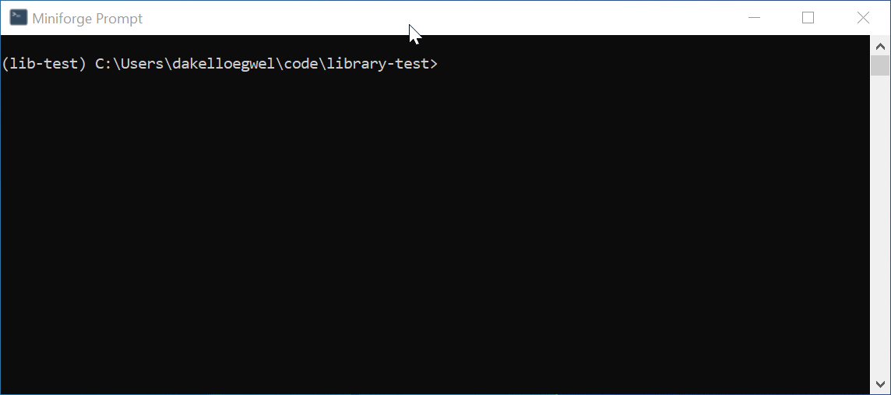

# Libraries

Libraries are akin to the programming equivalent of "expansion packs" in the gaming world. Just as expansion packs enhance the base game with additional features, libraries extend the capabilities of programming languages by providing pre-written code for specific tasks or functionalities.

## Installing Libraries


### `pip`
### Conda / Mamba
## Using Libraries

Simply installing a library doesn't immediately make it usable in our code. This is because the installed library needs to be explicitly imported into our Python code before we can access its functionalities.

### `import`

When we wish to use libraries that we've installed, we employ the `import` statement. Let's take the example of the `cowsay` library that was installed earlier:

```python
import cowsay
cowsay.say("Hello!")
```

Output:
```
  ______
| Hello! |
  ======
      \
       \
         ^__^
         (oo)\_______
         (__)\       )\/\
             ||----w |
             ||     ||
```

Now in VS try to run the Python code with the `base` Python rather than our `lib-test` environment. This can be done by going to Ctrl/Command + Shift + P and choosing "Select Interpreter." 

Now let's try to run the code again:

```
Traceback (most recent call last):
  File "C:\Users\dakelloegwel\code\testing\cowsay-test.py", line 1, in <module>
    import cowsay
ModuleNotFoundError: No module named 'cowsay'
```

While the `cowsay` library has been installed, it currently resides in the `lib-test` environment rather than the `base` environment. This is what gives us a `ModuleNotFoundError`. To fix this, we can again use Ctrl/Command + Shift + P to switch back to the `lib-test` environment in which the library was installed.

### `import as`

Python also allows us to import libraries in a slightly different way using the `import as`. Let's start by installing `numpy` to our `lib-test` library. NumPy is a powerful Python library used for numerical computing.

Now go to the Miniforge prompt (Windows) or the terminal (Mac) and make sure the `lib-test` environment has been activated. If it is, you should see the environment's name in brackets in the command prompt. Once that's done, install the NumPy library by using the command `pip install numpy`.



A quick way of checking if a library installed can be running Python in the terminal and then importing the library that you have just installed. Sometimes if something went wrong we might see a `ModuleNotFoundError` which indicates that there was a problem in the installation. As we see no such error here, we know that `numpy` was imported successfully.

A common convention when using libraries such as `numpy` is to employ shorthand aliases. Many users opt to utilize `numpy` commands by importing the library with the shorthand alias `np`. In Python, we may give libraries a "nickname" by using the `import as` command. Look at the examples below:

```ipython
>>> import numpy
>>> numpy.pi
3.141592653589793
```
Now we can do the same using `import as`:
```ipython
>>> import numpy as np
>>> np.pi
3.141592653589793
```
Using libraries in this way is entirely optional, but it can significantly enhance code readability and reduce typing effort.

### `from`

## Finding Libraries
## Summary
---
[Prev](functions.md) | [List of Contents](README.md) | [Next](oop.md)