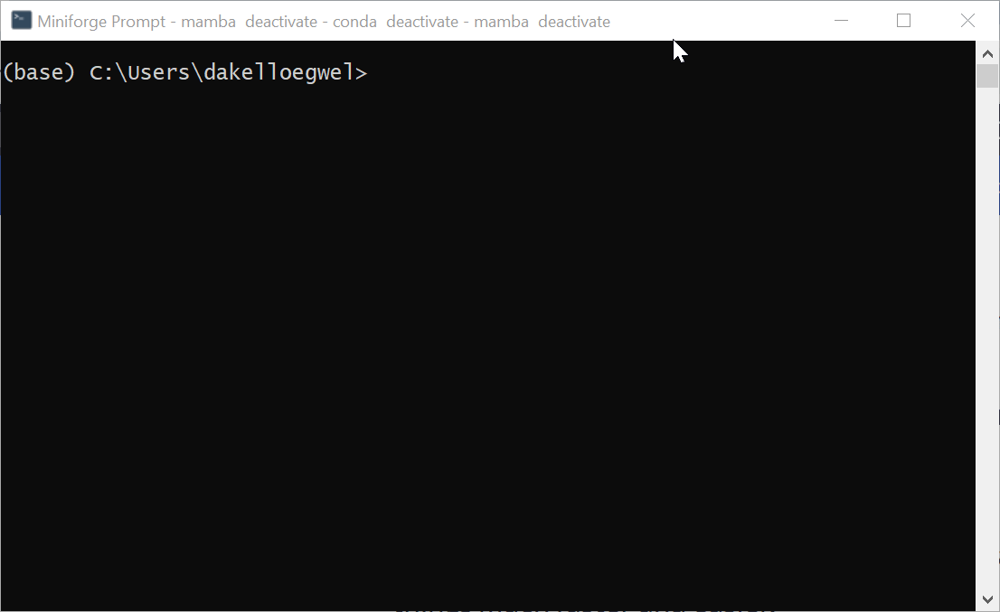

# Libraries

Libraries are akin to the programming equivalent of "expansion packs" in the gaming world. Just as expansion packs enhance the base game with additional features, libraries extend the capabilities of programming languages by providing pre-written code for specific tasks or functionalities.

## Installing Libraries

To start with, let's create a dedicated environment for learning how to install and use libraries. This will allow us to experiment with libraries without affecting any other projects or system configurations.

To do this, in either the Miniforge prompt (Windows) or the terminal (Mac), create a new environment named `lib-test`. This can be done with either `conda` or `mamba`.

Mamba:
```
mamba create --name lib-test python=3.11
```

Conda:
```
conda create --name lib-test python=3.11
```

You will then be asked to confirm that you wish to install some additional packages. Type "Y" and hit Enter.

Once your environment has been created, you can then activate it. This is all shown below:



Now that we have created an environment, we can try out installing a library to it. Let's start by installing `numpy` to our `lib-test` library. NumPy is a powerful Python library used for numerical computing.

### `pip`

Pip is a package manager for Python that allows you to easily install and manage third-party libraries and dependencies. To install a library with pip, first make sure that the environment you wish to install the library to is active (this will be indicated by the environment's name appearing in parentheses on the right hand side of the terminal prompt). Now installing a library is simply a matter of using the command `pip install lib-name`. Let's try this out with the `numpy` library.


A quick way of checking if a library installed is running Python in the terminal and then importing the library that you have just installed. Sometimes if something went wrong we might see a `ModuleNotFoundError` which indicates that there was a problem in the installation. As we see no such error here, we know that `numpy` was imported successfully.

### Conda / Mamba

In some cases, Python libraries can also be installed through Conda/Mamba as well as pip. In such scenarios, you will find guidance on which tool to use for installation in the library's documentation or on their official website.


## Using Libraries

Simply installing a library doesn't immediately make it usable in our code. This is because the installed library needs to be explicitly imported into our Python code before we can access its functionalities.

### `import`

<!-- TODO: Create file and show installation of library. -->

When we wish to use libraries that we've installed, we employ the `import` statement. Let's take the example of the `cowsay` library that was installed earlier:

```python
import cowsay
cowsay.cow("Hello!")
```

Output:
```
  ______
| Hello! |
  ======
      \
       \
         ^__^
         (oo)\_______
         (__)\       )\/\
             ||----w |
             ||     ||
```

Now in VS try to run the Python code with the `base` Python rather than our `lib-test` environment. This can be done by going to Ctrl/Command + Shift + P and choosing "Select Interpreter." 

Now let's try to run the code again:

```
Traceback (most recent call last):
  File "C:\Users\dakelloegwel\code\testing\cowsay-test.py", line 1, in <module>
    import cowsay
ModuleNotFoundError: No module named 'cowsay'
```

While the `cowsay` library has been installed, it currently resides in the `lib-test` environment rather than the `base` environment. This is what gives us a `ModuleNotFoundError`. To fix this, we can again use Ctrl/Command + Shift + P to switch back to the `lib-test` environment in which the library was installed.

### `import as`

Python also allows us to import libraries in a slightly different way using the `import as`. 

A common convention when using libraries such as `numpy` is to employ shorthand aliases. Many users opt to utilize `numpy` commands by importing the library with the shorthand alias `np`. In Python, we may give libraries a "nickname" by using the `import as` command. Look at the examples below, where we get the value of Pi that NumPy has stored:

```pycon
>>> import numpy
>>> numpy.pi
3.141592653589793
```
Now we can do the same using `import as`:

```pycon
>>> import numpy as np
>>> np.pi
3.141592653589793
```
Using libraries in this way is entirely optional, but it can significantly enhance code readability and reduce typing effort.

### `from`

Sometimes you only want to use one or more specific items from a library. In Python, we can instruct it to import these by using the `from` keyword followed by the library name and the specific items you want to import, separated by commas. Let's say I _only_ need the value of pi from NumPy and nothing else:

```pycon
>>> from numpy import pi
>>> pi
3.141592653589793
```

By using `from`, we can avoid importing the entire library/module, which can save memory and reduce potential [namespace conflicts](https://www.analyticsvidhya.com/blog/2024/01/understanding-namespaces-in-python/#h-namespace-collision-and-resolution).

## Finding Libraries

### Online Search

A lot of the time, simply Googling "python + [thing you want to do]" can lead you to various online resources, forums, and discussions where people share recommendations and insights about Python libraries that can help you accomplish your specific task or solve your problem.

### GitHub

GitHub also has options to search for code by language or by tag. While this is not guaranteed to bring up libraries only, this method of searching can help you discover open-source projects, including Python libraries, that tackle the same problems that you are attempting to solve or that provide functionalities you are looking for.

#### Language Search

Let's take the example of searching GitHub for code that contains the word "sonification" in either the repo name or the repository description: https://github.com/search?q=sonification+language%3APython&type=repositories

In the left hand side, it is possible to select a language for filtering your search results. In this example, I have chosen Python (but you could do this with any other language that GitHub is familiar with).


Another way of searching by language is to add `language:Python` to your search. 

Now from looking at the results, I can see there is a Python library called [isobar](https://github.com/ideoforms/isobar) that deals with sonification and music. The other results may also be a good starting point or provide some inspiration of how to go about a project.


You may also decide to [fork](https://docs.github.com/en/pull-requests/collaborating-with-pull-requests/working-with-forks/fork-a-repo) another person's code, which allows you to create a copy of their repository under your own GitHub account. Forking gives you the freedom to modify the code to suit your requirements, contribute improvements or fixes, or simply learn from the codebase.

#### Topic Search

GitHub also allows you to look for repositories by topic. This can help you discover curated collections of repositories related to specific themes or domains, making it easier to find Python libraries and projects relevant to your interests or needs.

Using this feature, we can find repositories with the topic "machine-learning": https://github.com/topics/machine-learning

Now if we filter by language, we can find Python code with the machine-learning topic:


#### Feed

Another way to discover interesting code is to look at your GitHub Feed. This is a personalized stream of updates from repositories, organisations, and users that you follow on GitHub. To customize your feed, try following topics, organisations, and users across GitHub that align with your interests or experience. This way, you'll receive updates and notifications about new projects, releases, and contributions that match your preferences.

By taking a quick look at my own feed, I can see that Stable Diffusion was recently updated. This lets me know that there have been changes or improvements made to the project, and it may be worth checking out the latest version to see what's new or to incorporate any updates into my own work.


## Summary
---
[Prev](functions.md) | [List of Contents](README.md) | [Next](oop.md)