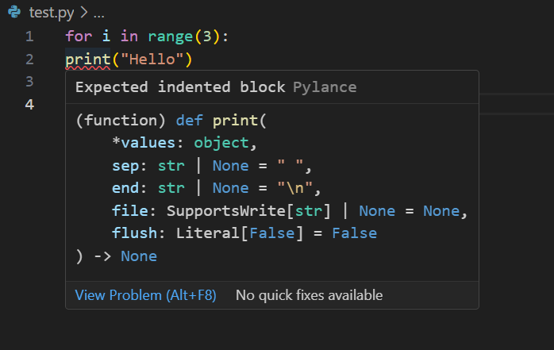
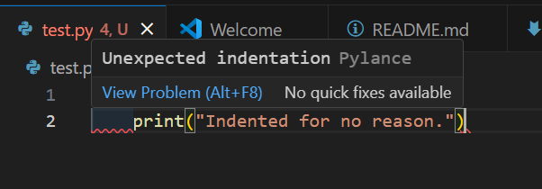

# Loops

Loops can be used for iterating over a sequence, or for repeating a block of code. They are a bit like the programming equivalent of a conveyor belt.


## For Loops

Loops allows us to repeat a block of code. This can be useful when we want to do something with every element in a Collection (Lists, Tuples, Dictionaries, Sets) as well as Sequences such as Strings.

Let's say we have a list of strings that contain a mix of uppercase and lowercase characters.

```python
mixed_strings = ["Hello", "wOrlD", "PyThOn", "ProGRamming", "Is", "FuN"]
```

What if we want to print the strings in all lowercase? We can use the `.lower()` command to convert a string to lowercase, but we need to run this on _every_ string in our List. Here is the not-so-fun way of doing it.

```python
print(mixed_strings[0].lower())
print(mixed_strings[1].lower())
print(mixed_strings[2].lower())
print(mixed_strings[3].lower())
print(mixed_strings[4].lower())
print(mixed_strings[5].lower())
```

While this "solution" works, it is not maintainable and is far more fiddly. If I were to mistakenly What we want to use instead is a for-loop.

```python
mixed_strings = ["Hello", "wOrlD", "PyThOn", "ProGRamming", "Is", "FuN"]

for mixed_string in mixed_strings:
    print(mixed_string.lower())
```

This gives the following output:

```
hello
world
python
programming
is
fun
```

Strings can also be looped through in this way:

```python
for char in "hello":
    print(char)
```

Output:
```
h
e
l
l
o
```

### Dictionaries

In the case of Dictionaries, simply looping through them will give us their keys.

```python
capitals = {
    "United States": "Washington, D.C.",
    "United Kingdom": "London",
    "France": "Paris",
    "Germany": "Berlin",
    "Japan": "Tokyo",
    "China": "Beijing",
    "India": "New Delhi",
    "Brazil": "Brasília",
    "Russia": "Moscow",
    "Canada": "Ottawa"
}

for country in capitals:
    print(country)
```

Output:
```
United States
United Kingdom
France
Germany
Japan
China
India
Brazil
Russia
Canada
```

If we want to see both a key and a value, we need to loop through the `items()` of the Dictionary.

```python
capitals = {
    "United States": "Washington, D.C.",
    "United Kingdom": "London",
    "France": "Paris",
    "Germany": "Berlin",
    "Japan": "Tokyo",
    "China": "Beijing",
    "India": "New Delhi",
    "Brazil": "Brasília",
    "Russia": "Moscow",
    "Canada": "Ottawa"
}

for country, capital in capitals.items():
    print(country + ": " + capital)
```

Now we obtain the following output:

```
United States: Washington, D.C.
United Kingdom: London
France: Paris
Germany: Berlin
Japan: Tokyo
China: Beijing
India: New Delhi
Brazil: Brasília
Russia: Moscow
Canada: Ottawa
```

### `range()`

`range()` is a command in Python that gives us a sequence of numbers. By default it will start at zero. We can use this with a for-loop to repeat a block of code a fixed number of times.

```python
for i in range(3):
    print("Hello")
```

Output:
```
Hello
Hello
Hello
```

When we actually ask to see the `i` that is being obtained from `range()` at each _iteration_ in our loop, we can see how the `range()` command is performing its counting.

```python
for i in range(5):
    print(i)
```

Output:

```
0
1
2
3
4
```

When we give range a single number as an input (or parameter), it starts at zero and counts up by one, stopping before it reaches our input value.

### Indentation

Indentation is an important part of our Python code. This is how Python recognises that a certain bit of code belongs to a "block."

Consider the code below:
```python
for i in range(3):
    print("Hello from inside the loop.")
print("Hello from outside the loop.")
```

We have a for-loop that will repeat some code 2 times. Our second line with the `print` statement is indented, meaning that there are some spaces at the beginning of the line. Our third line of code containing the other print statement is not indented. It shares the same _level of indentation_ as our "loop header."

This gives us the following output:
```
Hello from inside the loop.
Hello from inside the loop.
Hello from inside the loop.
Hello from outside the loop.
```

Only our first print statement is "looped" because it's loop's code block.

### IndentationError

When we misuse indentation, we can get what is known as an `IndentationError`.

Take the example of a for-loop that doesn't have an indented block.

```python
for i in range(3):
print("Hello")
```

See what VS Code does when given this code:



We have a red squiggly line beneath our `print`. Placing our mouse over this also causes a message to appear. This lets us know that we are going to get an error from running this code.

Output:
```
  File "<stdin>", line 2
    print("Hello")
    ^
IndentationError: expected an indented block after 'for' statement on line 1
```

We can see that an indented block was expected after the `for`, but that none was found. Now, let's do the opposite and add an indent that has no reason to be there.

```python
print("Hello")
    print("Indented for no reason.")
```

Again, VS Code lets us know that something isn't right here.



Output:
```
  File "<stdin>", line 1
    print("Indented for no reason.")
IndentationError: unexpected indent
```

Now we have another `IndentationError`, but this one is complaining about the opposite issue. An indent appeared for no reason.

Fixing the code is pretty simple:

```python
for i in range(3):
    print("Hello")
```

Output:
```
Hello
Hello
Hello
```

Now we can fix the other code as well:

```python
print("Hello")
print("Indented for no reason.")
```

Output:
```
Hello
Indented for no reason.
```

## While Loops

While loops allow us to repeat a block of code until a certain condition is met. In the example below, the while loop will continue so long as `i` is less than 6:

```python
i = 1
while i < 6:
  print(i)
  i += 1
```

Output:
```
1
2
3
4
5
```

While loops come in handy when you want to run code until a particular logical expression becomes True or False. An example could be looping code that asks for user input, and repeatedly asking for input until a valid response is given. In the [Control Flow and Conditional Statements](control-flow.md) section you will learn a bit more about how to write code that involves conditional logic.

## Comprehensions

Comprehensions are seen as a more "Pythonic" way of doing operations with Collections and Sequences.

Typically, when we have a `for` in our code, we want a block of indented code to be on the following line. In the case of Comprehensions, however, not having an indented block is fine.

```python
squares = [x ** 2 for x in range(10)]
print(squares)
```

Output:
```
[0, 1, 4, 9, 16, 25, 36, 49, 64, 81]
```

Now let's try the same without a Comprehension:

```python
squares = []

for i in range(10):
    squares.append(i ** 2)

print(squares)
```

Here the `.append()` command is being used to add a new element to our list.

Output:
```
[0, 1, 4, 9, 16, 25, 36, 49, 64, 81]
```

While the output is the name, using a standard for-loop requires more lines of code to accomplish the same task.

Comprehensions are a more concise and "readable" (to some) alternative to loops.

## Summary
- Loops are able to iterate over a Collection/Sequence or repeat a block of code.
- For loops can be used to repeat some code a set number of times.
- While loops can be used to repeat some code until a condition is met.
- `range()` allows us to generate a sequence of numbers.
- Indentation is a crucial part of Python code. It allows us to tell Python what we want to be inside or outside a loop.
- Comprehensions are seen as the more concise and "Pythonic" way of performing operations involving Collections and Sequences.
---
[Prev](collections.md) | [List of Contents](README.md) | [Next](control-flow.md)