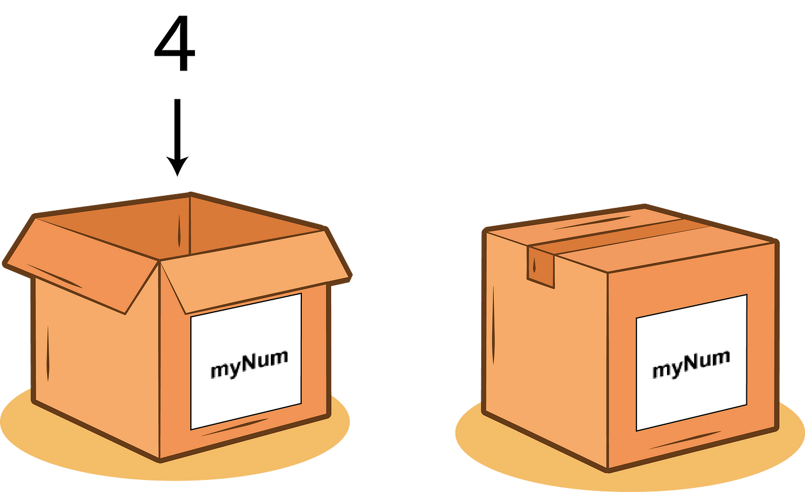

# Variables

Following the steps in the previous section, create a new file and call it variables.py.

## Variable Assignment

We can use code like `print(3 + 2)` to display the result of an operation. However, this value isn't stored anywhere.

Using a **variable** allows us to place information in a box so that it may be used again later.



In the code below, we can obtain the result of a calculation and then use it again later.

```python
my_val = 10 + 2
print(my_val)
```

When a variable is given a value, we call this **variable assignment**. The equals (=) symbol is often refered to as the **assignment operator**.

The **assignment operator** is how we let Python know that we want to take a box with a particular label, and place some information in the box. Then if we ever want to see or use what's inside that box again, we can use the variable's name to access the information another time.

Python, unlike some other languages, isn't especially fussed about knowing in advance what _type_ of information you wish to place inside a box.

## Name Error

Something we can't do is attempt to access a variable that has never been created. In Python this leads to what is known as a **NameError**.

Run the code below and examine the output:

```python
my_val = 2
print(my_val)

my_other_val = 3
print(my_other_val)

print(this_does_not_exist)
```

## Variable Reassignment

It's also possible to change the information that's inside a box. This is known as *variable reassignment*. Try running the code below:

```python
year = 2023
print(year)
my_age = 2024
print(year)
```

The `year` variable starts out as having the value 2023. This is then replaced with the value 2024. This is like taking the 2023 that was in the box to start with then chucking it away, and replacing it with the 2024. The 2023 is now "lost" and can't be retrieved.

### Garbage Collection

If some data no longer belongs to any boxes then it can't be accessed. In Python, something called the **garbage collector** will delete this boxless data for you so that the memory used to store it can be freed for something else. This is in contrast to languages such as C and Fortran, where freeing memory is something that has to be done manually. While this allows programs to be extremely fast, this also has the downside of leading to issues such as memory leaks. Python uses **reference counting** to determine when some data doesn't belong to any boxes, and is thus safe to delete.

### Multiple Boxes

It is possible for the same data to belong to multiple boxes. Try running the code below:

```python
 name = "Sydney"
 city = name
 print(name)
 print(city)
```

The Python `is` keyword can be used to check if two variables are referring to the same _object_ (Objects will be covered in greater detail later on in this tutorial). Try seeing what happens when you run this extra line of code below.

```python
city is name
```

## Naming Variables

Python has certain rules about naming variables.

- A variable name can only contain alpha-numeric characters and underscores (A-z, 0-9, and _ ).
- A variable name must start with a letter or the underscore character. It _cannot_ start with a number.
- Variable names are case-sensitive (`age`, `Age` and `AGE` are three different variables).
- A variable name cannot be any of the Python [keywords](https://www.w3schools.com/python/python_ref_keywords.asp) (these are also often called _reserved words_).

Here's an example of some code that violates our final rule:

```python
is = "you shouldn't do this"
```
This then leads to the following error:
```
  File "<stdin>", line 1
    is = "you shouldn't do this"
    ^^
SyntaxError: invalid syntax
```
## Summary
- Variables are like labelled boxes for data.
- We are not allowed to attempt to access a variable that has not been created. This leads to the code generating a **NameError**.
- When we swap what was previously inside a variable with some other data, this is known as **reassignment**.
- The Python **garbage collector** will automatically destroy data that doesn't belong to a box.
- It is possible for the same bit of data to belong to multiple boxes.
- Python requires that variables be named in a certain way. Going against these rules leads to the **SyntaxError**.
---
[Prev](getting-started.md) | [List of Contents](README.md) | [Next](basic-data-types.md)